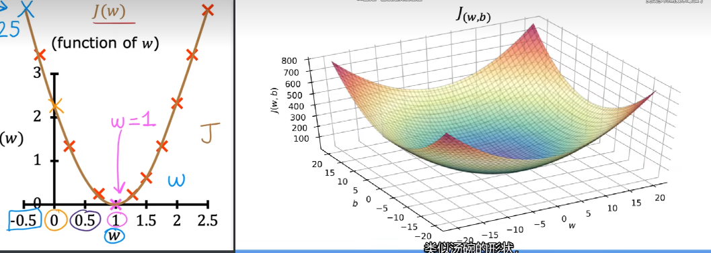
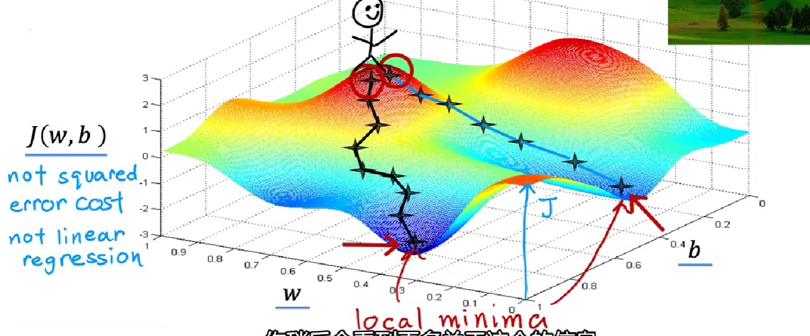
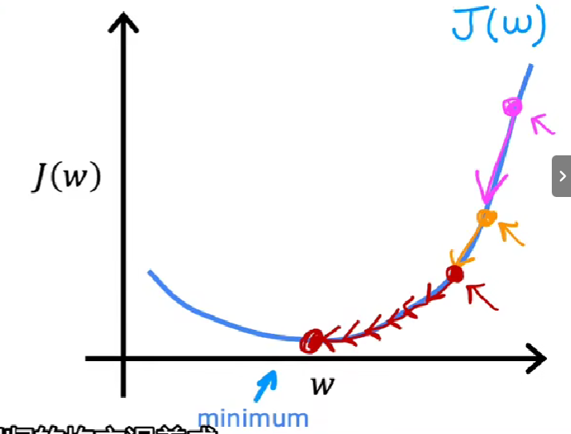

# Terminology 术语

- Training set 训练集

  ## Notation 符号

- $ x $ : 输入变量/特征值

- $ y $ : 输出变量/目标值

- $ m $ : 训练样本总数

- $ (x,y) $ 一个训练样本

- $ (x^{(i)},y^{(i)}) $ 第 i 个训练样本

# 监督学习模型

$ x → f → \hat{y} $​

$ x $ feature 输入变量

$ f $ model 模型

$ \hat{y} $ prediction 对 y 的估计或预测

# Linear regression model  线性回归模型 

 **别名**:Univariate linear regression 单变量线性回归

**definition**:只拥有**一个**输入变量 $x$ ​ 

**Model:** $ \hat{y} =  f_{w,b}(x) = w x + b $ 

​	$ w,b $​ : parameters 参数

​	$ w $ : weight 权重

​	$ b $ : y-intercept y截距

 问题：如何找到一对合适的参数 $ w,b $ 使得 $ \hat{y}^{(i)} $ 接近 $ y^{(i)} $ ——构建**成本函数(Cost function)**

# Cost function 代价函数

$ \hat{y} - y $ : error 误差

**平方误差代价函数**  $J(w,b) =  \frac{1}{2m} \sum\limits_{i=1}^{m}{(\hat{y}^{(i)} - y^{(i)})^2} $    

- $ \frac{1}{2m} $ 2m的系数方便微分

- $ m $​ 样本总数

目标：使$ J(w,b) $ 的值尽可能小 $ \mathop{minimize}\limits_{w,b} J(w,b) $​

 

# Gradient descent 梯度下降

一种用来尝试求任意的函数 如$ J(w,b) $  的最小值 $ \mathop{min}\limits_{w,b} \ J(w,b)$ 的方法

## 方法

1. 设置一对$w,b$ 的初始值
2. 不断改变$w,b$使$J(w,b)$值减小（往梯度下降最快的方向走）
3. 直到接近最小值

## 算法实现

$ w = w - \alpha\frac{\partial}{\partial w} \ J(w,b)$

$ b = b-\alpha \frac{\partial}{\partial b} J(w,b)$​  

- $ \alpha \in (0,1) $ learning rate,学习率（下坡时迈的步幅）

- 重复上述过程，直到算法收敛（w,b不再随迭代发生很大变化）

## Learning rate 学习率

- 学习率太小：梯度正确下降，但是收敛太慢
- 学习率太大：可能越过最小值，甚至发散
- 由于极小值附近**梯度趋向于0**，因此随着迭代进行，**微分绝对值下降**，从而每次迭代**步幅下降**。即使$\alpha$​ 不变，梯度下降算法依然能够到达局部最小值。 

 

## 公式推导

平方差代价函数：$J(w,b) =  \frac{1}{2m} \sum\limits_{i=1}^{m}{(\hat{y}^{(i)} - y^{(i)})^2} $  

线性回归模型：$ \hat{y} =  f_{w,b}(x) = w x + b $ 

$ \begin{equation}\begin{aligned}\frac{\partial}{\partial w}J(w,b) &= \frac{\partial}{\partial w}\frac{1}{2m}\sum\limits_{i=1}^{m}(f_{w,b}(x^{(i)})-y^(i))^{2} \\&=\frac{\partial}{\partial w}\frac{1}{2m}\sum\limits_{i=1}^{m}(wx^{(i)}+b-y^{(i)})^{2} \\&=\frac{1}{m}\sum\limits_{i=1}^{m}(f_{w,b}(x^{(i)}) - y^{(i)})x^{(i)} \end{aligned}\end{equation}$  

$ \begin{equation}\begin{aligned}\frac{\partial}{\partial b}J(w,b) &= \frac{\partial}{\partial b}\frac{1}{2m}\sum\limits_{i=1}^{m}(f_{w,b}(x^{(i)})-y^(i))^{2} \\&= \frac{\partial}{\partial b}\frac{1}{2m}\sum\limits_{i=1}^{m}(wx^{(i)}+b-y^{(i)})^{2} \\&= \frac{1}{m}\sum\limits_{i=1}^{m}(f_{w,b}(x^{(i)}) - y^{(i)})\end{aligned}\end{equation}$  

## 用于线性回归的梯度下降

重复以下过程直到收敛 $ \{$

$ \begin{equation}\begin{aligned}\frac{\partial}{\partial w}J(w,b) =\frac{1}{m}\sum\limits_{i=1}^{m}(f_{w,b}(x^{(i)}) - y^{(i)})x^{(i)} \end{aligned}\end{equation}$​  

$ \begin{equation}\begin{aligned}\frac{\partial}{\partial b}J(w,b) = \frac{1}{m}\sum\limits_{i=1}^{m}(f_{w,b}(x^{(i)}) - y^{(i)})\end{aligned}\end{equation}$  

$\}$

线性回归模型的$J(w,b)$只有一个全局最小值，不会进入局部最小值（是碗状的）

因此线性回归模型使用梯度下降法，一定能够找到$\min\limits_{w,b}J(w,b)$

## Batch gradient descent 批量梯度下降

在梯度下降的每一步都使用**全部**的训练用例

