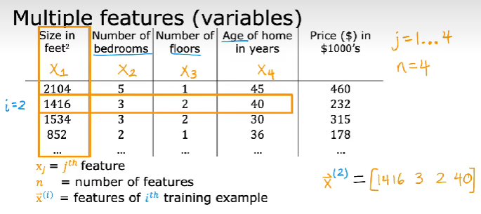
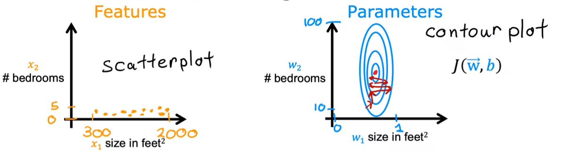
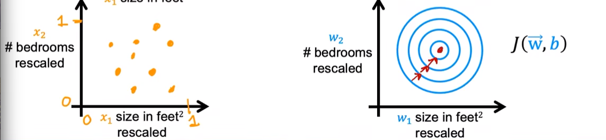
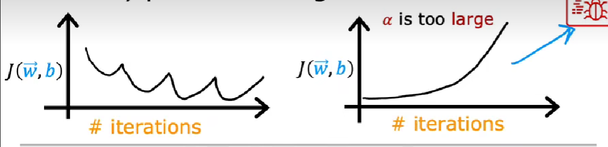
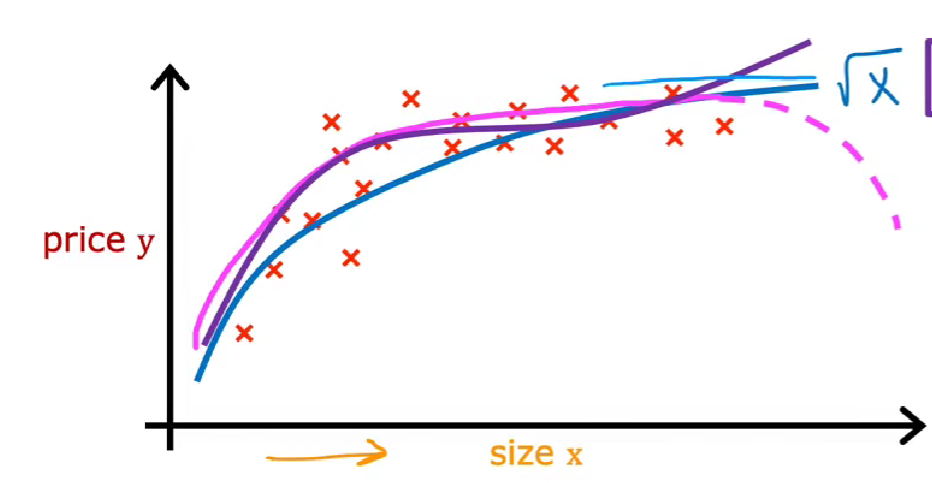

# Multiple features 多维特征

 

$ x_j $ 第 j 列，第 j 个输入变量（特征）

$ n $  列数，特征数量

$ \vec{x}^{(i)}$ 第 i 个训练用例的所有特征（行向量） 

$ \vec{x}_{j}^{(i)} $ 第 i 个训练用例的第 j 个特征的值

# Multiple linear regression 多元线性回归

## Model

$\begin{aligned} f_{\vec{w},b}(\vec{x}) & = \vec{w}·\vec{x} + b \\ &=\sum\limits_{j=1}^{n}w_jx_j + b \end{aligned} $ 

- $\vec{x} = [x_1 \ x_2 \ x_3 \ \ldots \ x_n]$

- $ \vec{w} = [w_1 \ w_2 \ w_3 \ldots \ w_n]$

## Cost function

$J(\vec{w},b) = \frac{1}{2m}\sum\limits_{i=1}^{m}(f_{\vec{w},b}(\vec{x}^{(i)})-y^{(i)})^{2}$​

## Gradient descent 梯度下降

$\frac{\partial}{\partial w_j}J(\vec{w},b) = \frac{1}{m}\sum\limits_{i=1}^{m}(f_{\vec{w},b}(\vec{x}^{(i)})-y^{(i)})x_j^{(i)}$

repeat{

$w_j = w_j - \alpha\frac{\partial}{\partial w_j}J(\vec{w},b)$

$b = b - \alpha\frac{\partial}{\partial b}J(\vec{w},b)$

}

# Normal equation 正规方程法

- 只用于线性回归求最小代价
- 不需要迭代

- 当特征数量很多时(>10000)，正规方程法会很慢

# Feature Scaling 特征缩放

- 使梯度下降更快

- 如果多个特征取值 $x_j$ 范围差别很大，导致不同的权重 $w_j$ 的变化对 $x_j$ 的影响不一样大，导致梯度下降过程中来回弹跳。

  

- 将特征缩放到同一范围后$(0,1)$，梯度下降过程能够更快收敛

  

## 特征缩放方法

- 除以最大值

- Mean normalization 均值归一化

- Z-score normalization Z-score 归一化  

## Meam normalization 均值归一化

$\mu_j = \frac{1}{m}\sum\limits_{i=1}^{m}x_j^{(i)}$  // 均值

$ x_j = \frac{x_j-\mu_j}{\max{x_j}-\min{x_j}} \in [-1,1]$

## Z-score 归一化

$\mu_j = \frac{1}{m}\sum\limits_{i=1}^{m}x_j^{(i)}$  // 均值

$\sigma_j = \sqrt{\frac{1}{m}\sum\limits_{i=1}^{m}(x_j^{(i) } - \mu_j)^2}$  //标准差

$x_j = \frac{x_j - \mu_j}{\sigma_j}$

## 经验

尽量让特征范围在$[-1,1]$附近

尽量让所有特征取值范围相差不大

# Automatic convergence test 自动收敛测试

$ \epsilon = 10^{-3}$

$ if \ \Delta J(\vec{w},b) \le \epsilon \ then  \ 收敛$

# 设置学习率

 

- 学习率设置太大，会导致代价函数波动或单调递增
- 学习率设置太小，导致代价函数收敛过慢

- 可以先设置一个非常非常小的学习率，观察代价函数是否会随迭代下降。如果不下降，说明代码中存在错误。

- 可供尝试的学习率 0.001 0.01 0.1 1，从小的开始尝试，每次×3倍，直到选择到尽可能大而且能够收敛的学习率。

# Feature engineering 特征工程

借助知识或直觉，通过**变换或结合现有特征**的方式，设计出**新的特征**，以使算法更容易做出准确的预测。

# Polynomial regression 多项式回归

 

如果特征和答案的关系如上，需要使用曲线拟合，可选用模型有可能包括：

- $f_{\vec{w},b}(x) = w_1x + w_2\sqrt{x} + b$

- $f_{\vec{w},b}(x) = w_1x+w_2x^2+w_3x^3 + b$

