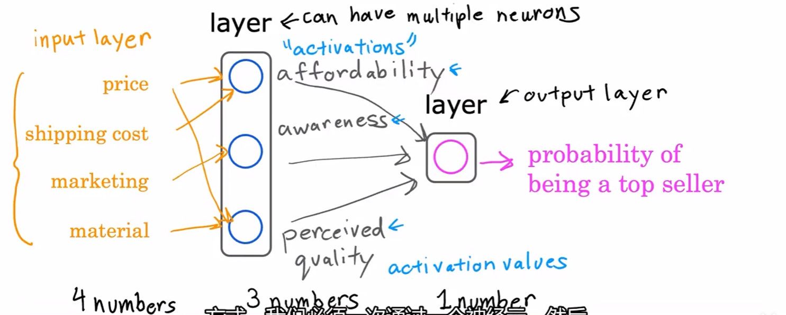
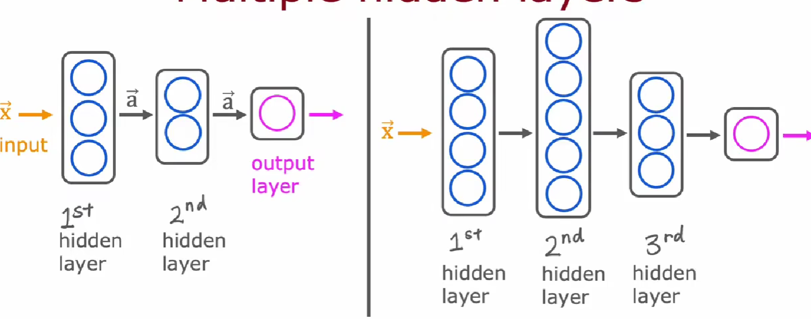
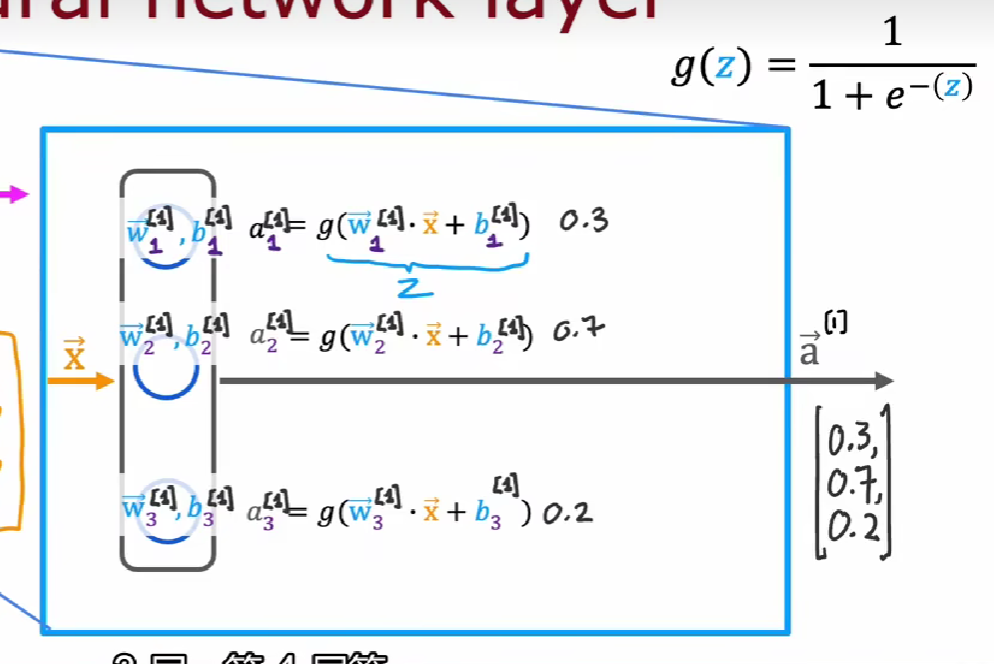
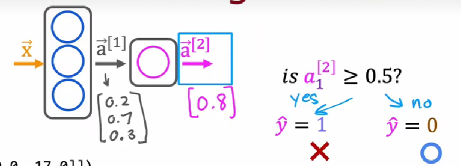
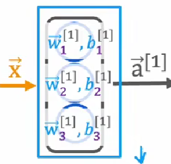

# 神经元与神经网络

## 神经元

**Model** $ input \ x \rightarrow \text{neuron} \rightarrow \ output \ a$

- **a**  激活（activation，神经学术语，表示一个神经元向下游的其他发送了多少电脉冲输出）

## layer 层

一**组**输入**相同或相似**的神经元

- input layer 输入数据 layer[0]
- output layer 输出最终结果的一层
- 输入层为第0层
- 



## Hidden layer 隐藏层   

把输入数据的特征，抽象到另一个维度空间，来展现其更抽象化的特征，这些特征能更好的进行线性划分。



- 对于第 l 层的参数，使用**上标 [l]** 标识层数 

 

- 每一层的每一个神经元都有独立的逻辑回归参数和模型
- $  a_j^{[l]} = g(\vec{w}_j^{[l]}·\vec{x} + b_j^{[l]})  $​ 
- $  a_j^{[l]} = g(\vec{w}_j^{[l]}·\vec{a}^{[l-1]} + b_j^{[l]})  $​ 
- $ g(x) $ activation function 激活函数
- l 是神经网络第 l 层
- j 是同一层神经网络中第 j 个神经元

# Activation function 激活函数

每个神经元输出激活值 $ a$ 的函数

 # Forward propagation 前向传播

自输入层到输出层的逐层激活计算。

越靠近输出层，隐藏层的神经元数量越少。

# 使用Tensorflow实现推理

 

```python
x = np.array([[200.0,17.0]])					 # 输入层，tensorflow需要接收一个矩阵形式的参数，所以必须是二维的
layer_1 = Dense(units=3,activation = 'sigmoid')	   # 第一层，三个神经元，激活函数sigmoid
a1 = layer_1(x)					 				# 第一层的输出 激活值 a1

layer_2 = Dense(units=1,activation = 'sigmoid')    # 第二层
a2 = layer_2(a1)								

if a >= 0.5 :									# 预测值
    yhat = 1
else:
    yhat = 0
```

# 搭建一个神经网路

```python
layer_1 = Dense(units=3,activations='sigmoid')
layer_2 = Dense(units=1,activations='sigmoid')
model = Sequential([layer_1,layer_2])			# 不用手动传播张量
x = np.array([200.0，17.0]，					  # 训练特征
            [120.0,5.0],
            [425.0,20.0],
            [212.0,18.0])
y = np.array([1,0,0,1])						   # 训练标签
model.compile(...)						       # 以后讲
model.fit(x,y)								  # 训练
model.predit(x_new)							  # 推理
```

# 单个神经网络内部的前向传播

不使用Tensorflow手动实现神经网络内部逻辑

 

- $ a_1^{[1]} = g(\vec{w}_1^{[1]}·\vec{x} + b_1^{[1]}) $

```python
w1_1 = np.array([1,2])
b1_1 = np.array([-1])
z1_1 = np.dot(w1_1,x) + b
a1_1 = sigmoid(z1_1)
```

- $ a_2^{[1]} = g(\vec{w}_2^{[1]}·\vec{x} + b_2^{[1]}) $

```python
w1_2 = np.array([-3,4])
b1_2 = np.array([1])
z1_2 = np.dot(w1_2,x) + b
a1_2 = sigmoid(z1_2)
```

- $ a_3^{[1]} = g(\vec{w}_3^{[1]}·\vec{x} + b_3^{[1]}) $

```python
w1_3 = np.array([5,-6])
b1_3 = np.array([2])
z1_3 = np.dot(w1_3,x) + b
a1_3 = sigmoid(z1_3)
```

```python
a1 = np.array([a1_1,a2_2,a3_3])
```

# 前向传播的一般实现

```python
W = np.array([
    [1,-3,5],
    [2,4,-6]])
b = np.array([-1,1,2])
a_in = np.array([-2,4])
```

```python
#实现 def dense(a_in,W,b,g)
def dense(a_in,W,b,g):
    units = W.shape[1]				# 行数，shape[1] -> 列数
    a_out = np.zeros(units)			
    for j in range(units):			
        w = W[:,j]					
        z = np.dot(w,a_in) + b[j]
        a_out[j] = g(z)
    return a_out
```

```python
# 实现 def sequential(x)
def sequential(x):
    a1 = dense(x,W1,b1)
    a2 = dense(a1,W2,b2)
    a3 = dense(a2,W3,b3)
    a4 = dense(a3,W4,b4)
    f_x = a4
    return f_x
```

- 约定，代码中，使用大写字母代表矩阵，使用小写字母代表张量

# 使用矩阵提高效率

使用矩阵运算可以调用GPU提高运算速度

```python
X = np.array([[200,17]])		# 使用矩阵，在传入dense前进行转置（这是约定）
W = np.array([[1,-3,5],
             [-2.4,-6]])
B = np.array([-1,1,2])
def dense(A_in,W,B):
    Z = np.matmul(A_in,W) + B	# 矩阵乘法
    A_out = g(Z)
    return A_out
```


