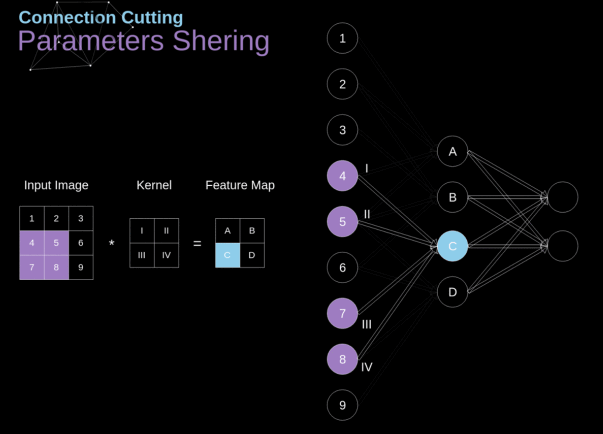
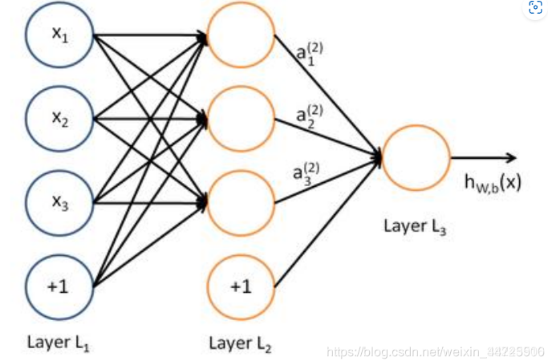

# CNN （Convolution Neural Network）

## 局部链接 Local Connection

层间神经只有**局部范围**内连接，在这个**局部范围**内采用全连接

 

全连接：层间神经元完全链接（**这不是CNN的特点**）

 

## 权重共享 Shared Weights

同一个卷积核内部共享同一套参数

## 多层叠加 Multi-layer

 

输入层的宽度和高度对应于输入图像的宽度和高度，而它的深度为1

第一个卷积层对这幅图像进行了卷积操作，得到了三个Feature Map。因为图中看出这个卷积层包含三个Filter，也就是三套参数，每个Filter都可以把原始输入图像卷积得到一个Feature Map，三个Filter就可以得到三个Feature Map。

# GNN

