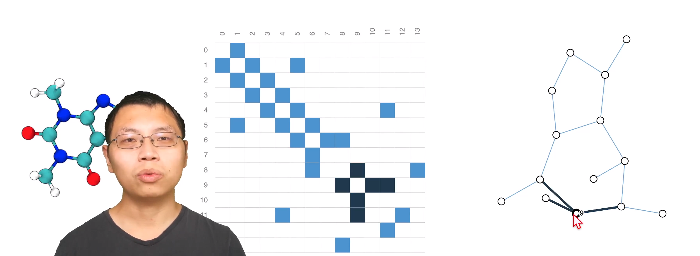

# 图 Graph

图 = 实体 + 关系

每个结点的值是由上一层部分结点计算得来

 

## 图的元素

### V（vertex / node）

属性：结点标识、邻居数量等

### E（edge / link）

属性：边标识、边权值

### U （global / master node）

表示整张图

属性：总边数、最长路径等

## 表示方法

图片表示成图（邻接矩阵）

 

文本表示成图

 

化学分子表示成图

 

# 图神经网络的三种任务

- 图层面：对图进行分类等
- 顶点层：判断每个点具有什么特征
- 边层面：判断点与点之间关系的属性是什么

# 图神经网络在机器学习中的问题

## 图连接性的表示问题

邻接矩阵

- 当顶点非常多时，占用空间很大

- 任意交换邻接矩阵中的两行/列，仍然表示同一张图。神经网络必须做到这两张图输入后得到的结果是一致的(保证对称信息)

稀疏矩阵：计算很麻烦，难以使用GPU操作稀疏矩阵

邻接列表：

邻接列表中的第 i 个元素 [k,j] 表示第 i 条边连接了第 k 和 第 j 个顶点。

