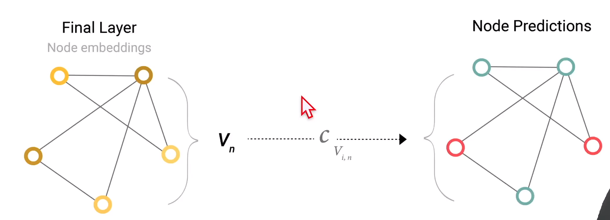
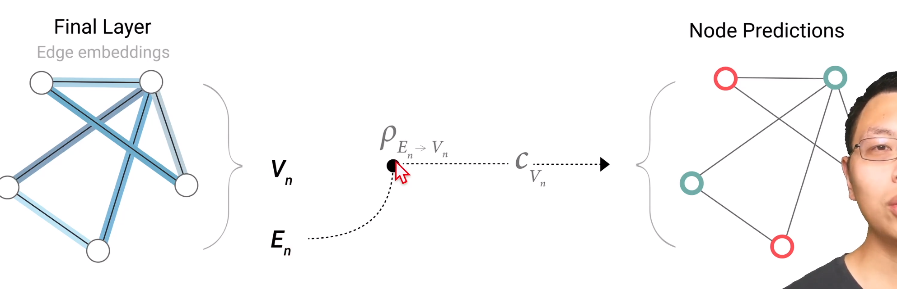
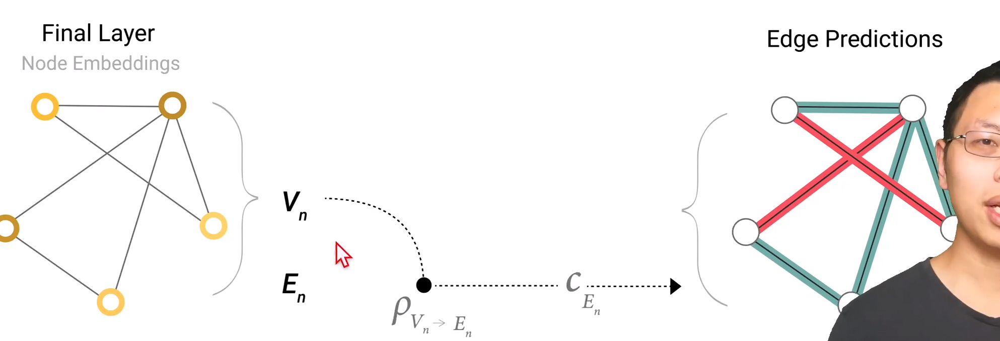
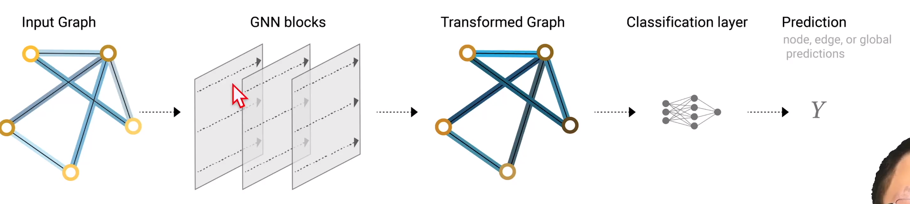
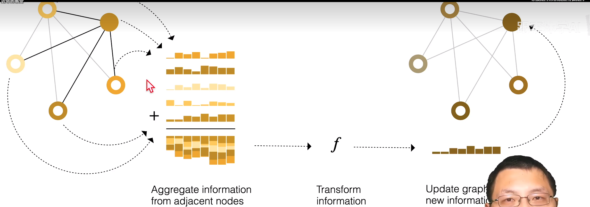
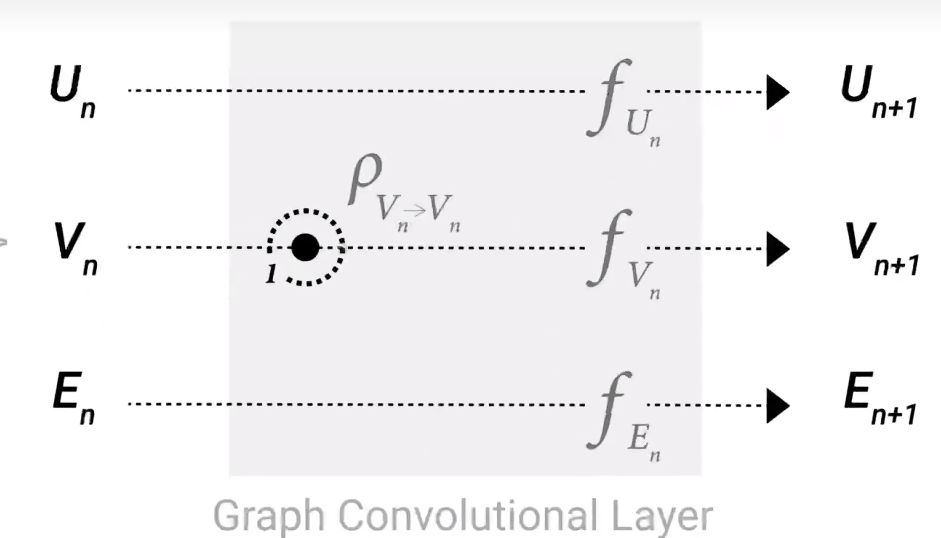
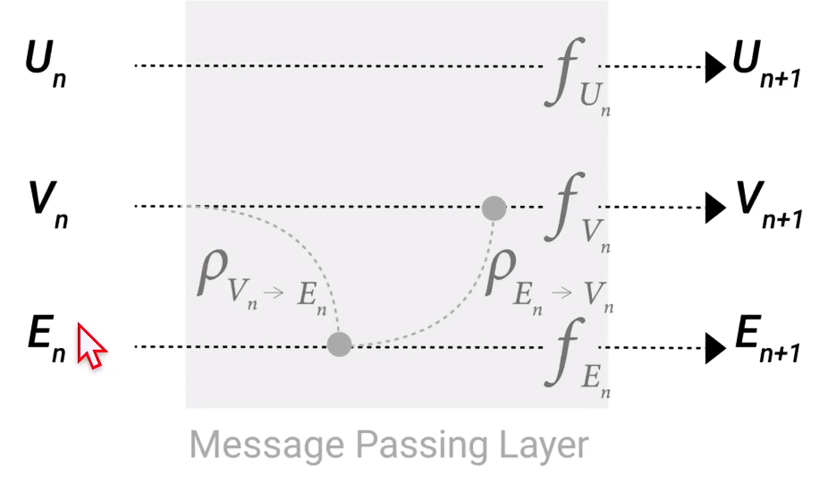
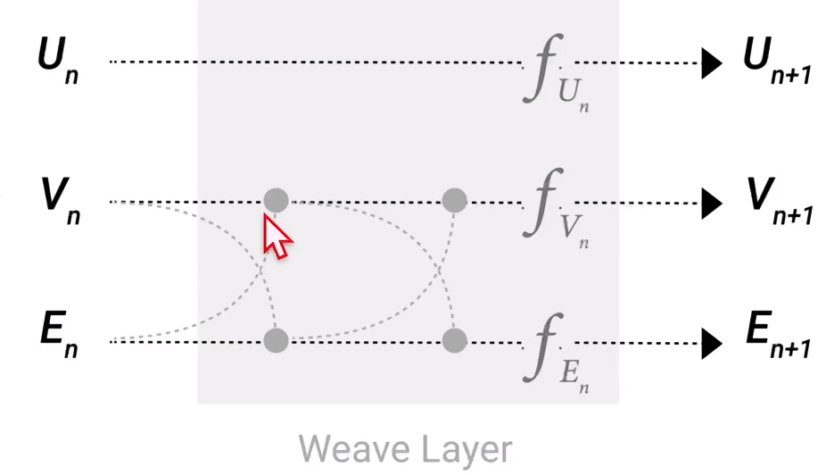
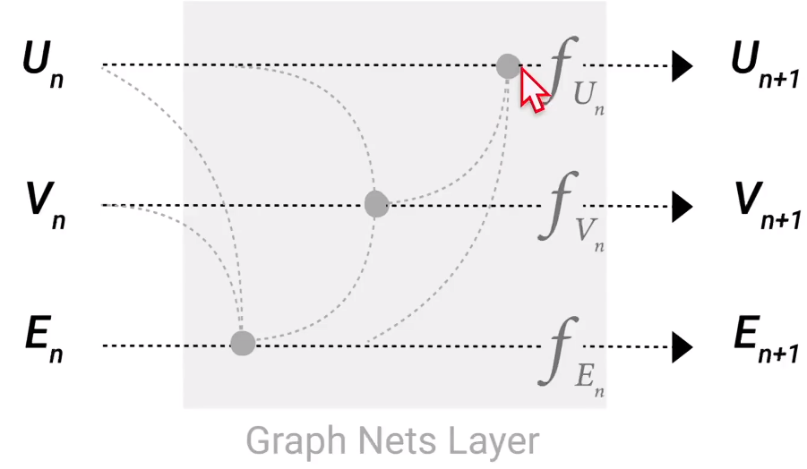
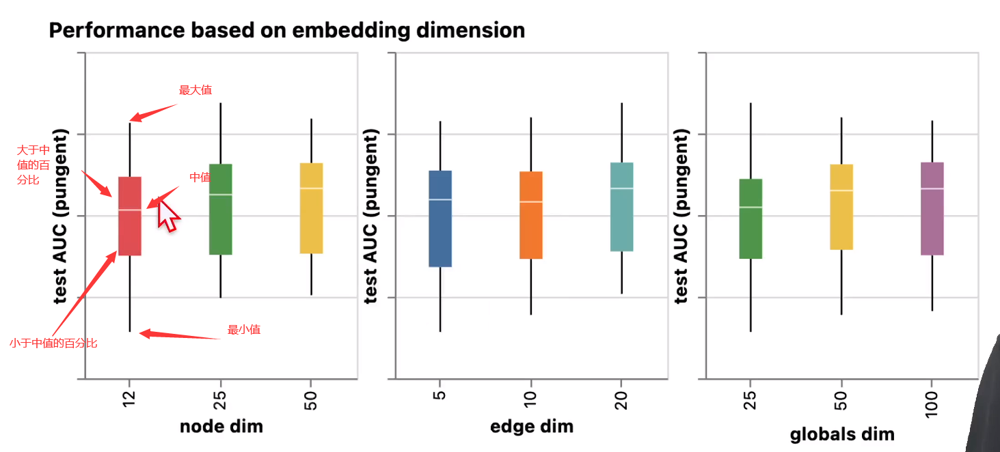

# GNN

定义：GNN 是对图上所有属性，进行的可以优化的变换，这个变换可以保留图的对称信息。

GNN输入是一个图 输出也是一个图，GNN 对图的变换不会改变图的连接性

$ U_n \rightarrow f_{U_n} \rightarrow U_{n+1} $

$ V_n \rightarrow f_{V_n} \rightarrow V_{n+1} $

$ E_n \rightarrow f_{E_n} \rightarrow E_{n+1} $

# 预测分类任务

在最后一层图数据后 经过一层全连接层 $  C_{V_{i,n}} $  再经过softmax，得到分类结果

 

## pooling 汇聚

当一个点，我们没有该点的向量，如何对其做预测

- 取与该顶点相连的边的向量 以及 全局向量， 相加得到顶点向量（要求各向量维度一样）

   

如果对边做预测，但是没有边的向量，可以使用同样的方法汇聚

 

# 图神经网络分类任务

# 信息传递

前面的分类任务并没有考虑到图的连接信息

汇聚过程：将被操作顶点向量与其邻居顶点向量加到一起，得到汇聚向量，对汇聚向量进行运算

 

 $ \rho_{V_n \rightarrow V_n} \text{将}V_n \text{的（一阶）邻居与} V_n \text{汇聚成新的 }V_n$ 

 

把顶点的信息传递给边，把边的信息传递给顶点

 

交替更新

 

### 全局信息

加一个虚拟的点master node(context vector)：使其与所有的顶点相连，与所有的边相连，以此为基础进行**汇聚**

  

## AUC

 

中值越高越好

bar 越长越敏感，不要特别长

