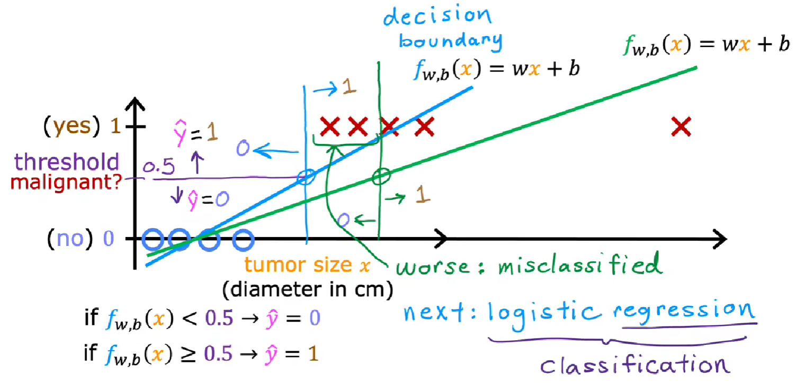
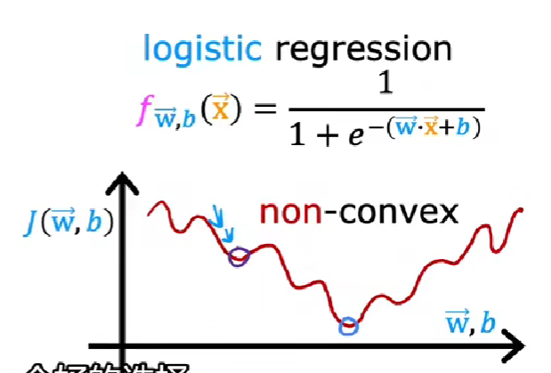

# 用回归解决分类问题

 

- 决策边界 decision boundary : 超过这个值$\hat{y} = 1$，低于这个值$\hat{y} = 0$​

# sigmoid function

 

$ g(z) = \frac{1}{1+e^{-z}} $ 

$ g(z) \in (0,1)$

# Logistic regression 逻辑回归

- 名字叫回归，但是也用于分类问题

- 输出值$\in (0,1)$

## Model

 $ z = \vec{w}·\vec{x} + b$

$ g(z) = \frac{1}{1+e^{-z}}$

$ \begin{equation} f_{\vec{w},b}(\vec{x}) = g(\vec{w}·\vec{x}+b) = \frac{1}{1+e^{-(\vec{w}·\vec{x} + b)}} \end{equation} $

## output

$ f_{\vec{w},b}(\vec{x}) = 0.7 \Leftrightarrow P(y=1)=0.7$ 

$f_{\vec{w},b}(\vec{x}) = P(y=1\mid \vec{x};\vec{w},b)$

##  Decision boundary 决策边界

$ \left. \begin{array}  \ f_{\vec{w},b}(\vec{x}) \ge 0.5  & \\ g(z) \ge 0.5 & \\ z \ge 0 & \\ \vec{w}·\vec{x} + b \ge 0 \end{array} \right  \} \Rightarrow \hat{y} = 1$

$ \left. \begin{array} \ f_{\vec{w},b}(\vec{x}) < 0.5  & \\ g(z) < 0.5 & \\ z < 0 & \\ \vec{w}·\vec{x} + b < 0 \end{array} \right  \} \Rightarrow \hat{y} = 0$

# Loss function 损失函数

## 逻辑回归的平方代价函数不是凸的(non-convex)

 

代价函数存在多个极小值

## Logistic loss function 逻辑损失函数

- 使用损失函数而非代价函数可以让函数编程“凸”的，并且能够到达全局最小值

$ \begin{aligned} L(f_{\vec{w},b}(\vec{x}^{(i)}),y^{(i)}) & = \left \{ \begin{array} \ - \log{(f_{\vec{w},b}(\vec{x}^{(i)})} & \ \text{ if $ y^{(i)} = 1 $ }   \\ - \log{(1-f_{\vec{w},b}(\vec{w}^{(i)}))} & \ \text{if $ y^{(i)} = 0$ } \end{array}  \right. \\&=  -y^{(i)} \log{(f_{\vec{w},b}(\vec{x}^{(i)})) - (1-y^{(i)})\log{(1-f_{\vec{w},b}(\vec{x}^{(i)}))}} \end{aligned}$

- 当真实值y = 1时，$ \hat{y} \rightarrow 1 \Rightarrow L \rightarrow 0$
- 当真实值y = 0 时，$ \hat{y} \rightarrow 0 \Rightarrow L \rightarrow 1$

# Cost function 代价函数

$ \begin{aligned} J(\vec{w},b) & = \frac{1}{m}\sum\limits_{i=1}^{m}L(f_{\vec{w},b}(\vec{x}^{(i)}),y^{(i)}) \\ &= \left \{ \begin{array} \ - \frac{1}{m}\sum\limits_{i=1}^{m}\log{(f_{\vec{w},b}(\vec{x}^{(i)})} & \ \text{ if $ y^{(i)} = 1 $ }   \\ - \frac{1}{m}\sum\limits_{i=1}^{m}\log{(1-f_{\vec{w},b}(\vec{w}^{(i)}))} & \ \text{if $ y^{(i)} = 0$ } \end{array}  \right. \\&=  -\frac{1}{m}\sum\limits_{i=1}^{m} \left [ y^{(i)} \log{(f_{\vec{w},b}(\vec{x}^{(i)})) + (1-y^{(i)})\log{(1-f_{\vec{w},b}(\vec{x}^{(i)}))}} \right] \end{aligned}$

# Gradient descent  梯度下降

$\frac{\partial}{\partial w_j}J(\vec{w},b) = \frac{1}{m}\sum\limits_{i=1}^{m}(f_{\vec{w},b}(\vec{x}^{(i)}) - y^{(i)})x_j^{(i)}$​

$\frac{\partial}{\partial b}J(\vec{w},b) = \frac{1}{m}\sum\limits_{i=1}^{m}(f_{\vec{w},b}(\vec{x}^{(i)}) - y^{(i)})$​

repeat j=1..n {

$ \begin{aligned} w_j & = w_j - \alpha \frac{\partial}{\partial{w_j}}J(\vec{w},b) \\&=w_j - \alpha \left[ \frac{1}{m}\sum\limits_{i=1}^{m}(f_{\vec{w},b}(\vec{x}^{(i)}) - y^{(i)})x_j^{(i)} \right] \end{aligned}$

$\begin{aligned} b& = b - \alpha \frac{\partial}{\partial{b}}J(\vec{w},b)  \\ &= b - \alpha \left[ \frac{1}{m}\sum\limits_{i=1}^{m}(f_{\vec{w},b}(\vec{x}^{(i)}) - y^{(i)})  \right]  \end{aligned}$

}

- 梯度下降算法看起来和线性回归一摸一样，但是$f_{\vec{w},b}(\vec{x})$的定义不一样

