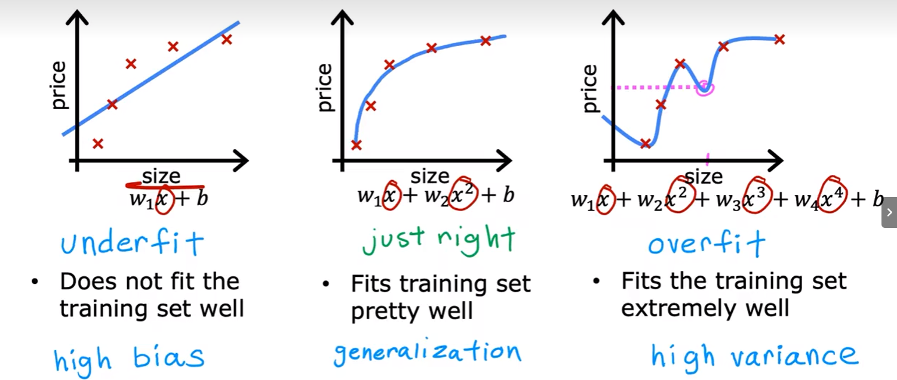

# Overfitting 过拟合

欠拟合：模型存在较高偏见(偏差,high bias)，不能很好拟合训练数据

过拟合:模型很好拟合训练数据，但是高方差(high variance)，泛化(generalization)很差

 

## 解决过拟合问题

- 使用充足的训练样本
- 只选择一部分特征进行训练（可能丢失有用的特征）
- 正则化：降低参数的大小（而不是彻底排除对应的特征），避免个别特征的参数过大引起模型波动

# Regularize 正则化

降低个别特征（不重要的特征）的参数大小，以降低个别特征对整个模型的影响，使拟合更平滑

比彻底去除特征更温和，因为我们很难主观判断哪个特征不重要

$J(\vec{w},b) = \frac{1}{2m}\sum\limits_{i=1}^{m}(f_{\vec{w},b}(\vec{x}^{(i)})-y^{(i)})^2 + \frac{\lambda}{2m}\sum\limits_{j=1}^{n}w_j^2 \left [ + \frac{\lambda}{2m}b^2 \right (\text{optional})]$

- $ \lambda > 0 $​ 正则化参数
- 加入$w_j$的平方和，但是目标是求$J(\vec{w},b)$最小值，所以训练过程中会使$w_j$​尽可能小
- 这里的 $ f_{\vec{w},b}(\vec{x}) = \vec{w}·\vec{x} + b $

# Regularized linear regression 线性回归正则化方法

 $ f_{\vec{w},b}(\vec{x}) = \vec{w}·\vec{x} + b $

$ \min\limits_{\vec{w},b}J(\vec{w},b) = \min\limits_{\vec{w},b} \left [ \frac{1}{2m} \sum\limits_{i=1}^{m} (f_{\vec{w},b}(\vec{x}^{(i)})-y^{(i)})^2 + \frac{\lambda}{2m} \sum\limits_{j=1}^{n}w_j^2 \right]$

## 梯度下降

repeat {

$ \begin{aligned}  w_j &= w_j - \alpha\frac{\partial}{\partial w_j}J(\vec{w},b) \\ & = w_j - \alpha \left [ \frac{1}{m}\sum\limits_{i=1}^{m}(f_{\vec{w},b}(\vec{x}^{(i)})-y^{(i)})x_j^{(i)} + \frac{\lambda}{m}w_j \right ] \\ &= \underbrace{ w_j(1-\alpha \frac{\lambda}{m})}_{ \text{比}w_j\text{略小} } - \alpha \frac{1}{m} \sum\limits_{i=1}^{m}(f_{\vec{w},b}(\vec{x}^{(i)}) - y^{(i)})x_j^{(i)}  \end{aligned} $

$ \begin{aligned} b &= b - \alpha\frac{\partial}{\partial b}J(\vec{w},b) \\ & = b - \alpha \frac{1}{m}\sum\limits_{i=1}^{m}(f_{\vec{w},b}(\vec{x}^{(i)})-y^{(i)}) \end{aligned} $

}

# Regularized logistic regression 逻辑回归正则化方法

$$ \begin{equation} f_{ \vec{w} , b }( \vec{x} ) =  \frac{1}{1 + e^{ -( \vec{w} · \vec{x} + b)}} \end{equation} $$​

$$ \begin{aligned} J(\vec{w},b) &=  -\frac{1}{m}\sum\limits_{i=1}^{m} \left [ y^{(i)} \log{(f_{\vec{w},b}(\vec{x}^{(i)})) + (1-y^{(i)})\log{(1-f_{\vec{w},b}(\vec{x}^{(i)}))}} \right] + \frac{\lambda}{2m}\sum\limits_{j=1}^{n}w_j^2 \end{aligned} $$

## 梯度下降

**公式上与线性回归没有变化，除了$  f_{\vec{w},b}(\vec{x})  $**

repeat{

$$ \begin{aligned}  w_j &= w_j - \alpha\frac{\partial}{\partial w_j}J(\vec{w},b) \\ & = w_j - \alpha \left [ \frac{1}{m}\sum\limits_{i=1}^{m}(f_{\vec{w},b}(\vec{x}^{(i)}) - y^{(i)})x_j^{(i)} + \frac{\lambda}{m}w_j \right ] \\ &= \underbrace{ w_j(1-\alpha \frac{\lambda}{m})}_{ \text{比}w_j\text{略小} } - \alpha \frac{1}{m} \sum\limits_{i=1}^{m}(f_{\vec{w},b}(\vec{x}^{(i)}) - y^{(i)})x_j^{(i)}  \end{aligned} $$​

$$ \begin{aligned} b &= b - \alpha\frac{\partial}{\partial b}J(\vec{w},b) \\ & = b - \alpha \frac{1}{m}\sum\limits_{i=1}^{m}(f_{\vec{w},b}(\vec{x}^{(i)})-y^{(i)}) \end{aligned} $$

}
