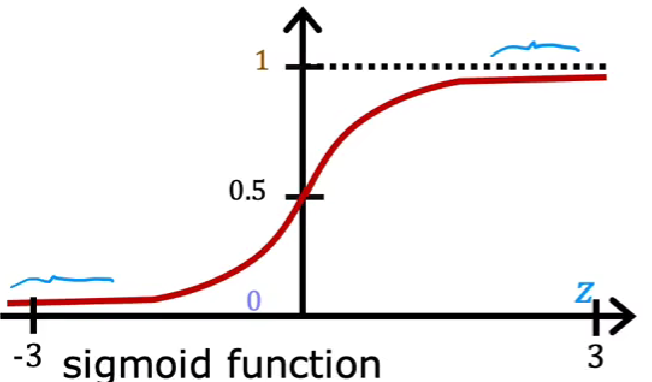

# sigmoid function

 

$ g(z) = \frac{1}{1+e^{-z}} $ 

$ g(z) \in (0,1)$

# Classification Error 分类错误率

最直接的损失函数

$ classification \ error = \frac{\text{count of error items}}{\text{count of all items}} $

# Mean Squared Error 均值方差

$MSE = \frac{1}{m}\sum\limits_{i=1}^{m}(\hat{y}^{(i)}-y^{(i)})^2$

# Cross Entropy Loss 交叉熵损失函数

## 二分类

$ L = \frac{1}{m}\sum\limits_{i=1}^{m}L_i=\frac{1}{m}\sum\limits_{i=1}^{m}-[y^{(i)}·\log(p^{(i)}) + (1-y^{(i)})·\log(1-p^{(i)})] $

- $ y^{(i)} $ 样本 i 的label，正类为 1 ， 负类为 0
- $ p^{(i)} $ 样本 i 预测为正类的概率

## 多分类

$ L = \frac{1}{m}\sum\limits_{i=1}^{m}L_i=-\frac{1}{m}\sum\limits_{i=1}^{m}\sum\limits_{c=1}^{N}y_{c}^{(i)}\log{p_{c}^{(i)}} $

- N 类别的数量

- $ y_c^{(i)} $ 符号函数(0 或 1)，如果样本 i 的真实类别等于 c 则取 1，否则取 0
- $ p_c^{(i)} $ 观测样本 i 属于类别 c 的预测概率

